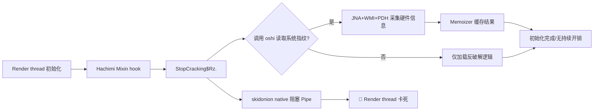

# PID 13644 分析报告：Minecraft 1.21.1 (Fabric) 卡死诊断

> **目标进程**：PID 13644  
> **分析时间**：2026-05-05  
> **核心结论**：Render thread 被 `skidonion` native 函数阻塞，根因来自 Hachimi 客户端的反破解模块。

---

## 🧠 进程身份

| 项目 | 值 |
|------|-----|
| 进程名 | Minecraft 1.21.1 (Fabric) |
| 启动器 | HMCL 3.13.0.338 |
| 玩家 | benjamin920103 |
| JDK | Java HotSpot 21.0.10 (64-bit) |
| 操作系统 | Windows 10 (TW locale) |
| 游戏路径 | `C:\Users\Library\Documents\jdk-21_windows-x64_bin\...\minecraft` |

---

## 🔴 关键问题：Render thread 卡住

```text
"Render thread" #1 [12004] cpu=22078ms elapsed=404s
  TIMED_WAITING (on object monitor)
  at java.lang.Object.wait0(Native Method)
  at java.io.PipedInputStream.read(PipedInputStream.java:332)
  - locked <0x0000000087f73e88>
  at skidonion.AhxTR.I.II1(Native Method)    ← 罪魁祸首
  at skidonion.AhxTR.ll.1(Native Method)
  at skidonion.AhxTR.___.___(Native Method)
  at me.hachimiclient.client.??StopCracking$Rz.<clinit>   ← Hachimi 客户端
```

**问题定位**：
- Render thread 被 native 函数 `skidonion.AhxTR.I.II1()` 阻塞
- 卡在 `PipedInputStream.read()` 等待数据
- 调用链源头：Hachimi 客户端的 `StopCracking` 反破解模块初始化

---

## 💾 内存状态（G1GC）

| 区域 | 使用 | 总计 |
|------|------|------|
| G1 Heap | 190 MB | 768 MB |
| Young Gen | 32 MB (1 region) | - |
| Survivors | 0 MB | - |
| Metaspace | 89 MB / 90 MB committed | 1.1 GB reserved |

> ✅ 堆使用正常，无内存压力

**JVM 参数**：
```bash
-XX:InitialHeapSize=128MB
-XX:MaxHeapSize=2048MB
-XX:MaxGCPauseMillis=50
-XX:+UseG1GC
```

---

## 🧵 线程状态概览

| 线程 | 状态 | 说明 |
|------|------|------|
| Render thread #1 | 🔴 TIMED_WAITING | 卡在 skidonion native |
| Reference Handler | RUNNABLE | 正常 daemon |
| Finalizer | WAITING | 正常 daemon |
| DFU cleaning thread | TIMED_WAITING | ModernFix mod |
| Yggdrasil Key Fetcher | TIMED_WAITING | 正版验证 |
| Java2D Disposer | WAITING | 正常 AWT |
| AWT-Windows | RUNNABLE | 正常窗口事件循环 |
| AWT-EventQueue-0 | WAITING | 正常 AWT 事件队列 |
| C2 Compiler | RUNNABLE | JIT 编译 (累计 14s CPU) |
| C1 Compiler | RUNNABLE | JIT 编译 (累计 2.9s CPU) |
| GC Threads (×8) | RUNNABLE | G1 并行 GC |

---

## 🔍 根因定位

```
skidonion native 库读取 Pipe 时永久阻塞
        ↓
导致 Render thread 卡死
        ↓
触发源：Hachimi 客户端 StopCracking 模块初始化
        ↓
可能原因：反作弊检测 / 环境校验 / 通信死锁
```

---

## ✅ 建议解决方案

1. **临时修复**：移除 Hachimi 客户端 mod，重启游戏验证
2. **版本检查**：确认 skidonion / Hachimi 是否有更新版本
3. **紧急终止**：若游戏已无响应，执行：
   ```cmd
   taskkill /PID 13644 /F
   ```

---

## 🔬 深度分析：oshi 生成链路

### 📦 类实例分布（class_histogram）

```text
实例数   字节大小   类名
  13     416 B    oshi.PlatformEnum              ← 单例缓存
   5     120 B    oshi.driver.windows.wmi.Win32PhysicalMemory$PhysicalMemoryProperty
   1     120 B    oshi.jna.Struct$CloseablePerformanceInformation
   1     104 B    oshi.jna.Struct$CloseableSystemInfo
   4      96 B    oshi.hardware.CentralProcessor$ProcessorCache$Type
   2      80 B    oshi.driver.windows.wmi.Win32Processor$ProcessorIdProperty
   4      96 B    oshi.driver.windows.perfmon.PagingFile$PagingPercentProperty
   1      40 B    oshi.util.Memoizer$1            ← 缓存持有内部类
   ... + Lambda 捕获对象
```

### 🔗 oshi 初始化链路

```text
me.hachimiclient.client.??StopCracking$Rz.<clinit>
    ↓
class_310.handler$bbo000$hachimi$hookInit()   ← HMCL Fabric Mixin 注入
    ↓
可能触发 oshi.SystemInfo.<clinit>
    └── oshi.util.Memoizer 缓存首次访问
           ↓
    ┌─────────────────────────────────────────┐
    │  oshi.SystemInfo.getHardware()           │
    │    ↓                                    │
    │  WindowsComputerSystem                   │  ← hostname / deviceId
    │    ↓                                    │
    │  WindowsGlobalMemory                     │  ← 物理内存
    │    ├── JNA: GlobalMemoryStatusEx()       │
    │    └── WMI: Win32_PhysicalMemory         │
    │    ↓                                    │
    │  WindowsCentralProcessor                 │  ← CPU 信息
    │    ├── JNA: GetLogicalProcessorInfo()    │
    │    ├── WMI: Win32_Processor              │
    │    └── perfmon: PagingFile 统计          │
    │    ↓                                    │
    │  oshi.jna.Struct$CloseableSystemInfo     │
    │    └── GetNativeSystemInfo()             │
    └─────────────────────────────────────────┘
```

### 🪟 Windows 系统调用映射

| JNA / WMI / perfmon | 底层 Windows API | 获取数据 |
|---------------------|------------------|----------|
| CloseablePerformanceInformation | kernel32!GlobalMemoryStatusEx | 物理内存总量/可用 |
| CloseableSystemInfo | kernel32!GetNativeSystemInfo | CPU 核心数/架构 |
| LogicalProcessorInformation | kernel32!GetLogicalProcessorInformation | CPU 缓存层级 |
| Win32_PhysicalMemory (WMI) | root\WMI → MS_SystemInformation | 内存条 SMBIOS 信息 |
| Win32_Processor (WMI) | root\WMI | CPU ID / 型号 / 核心数 |
| PagingFile (perfmon) | perfmon PDH | 分页文件使用率 |

### ⚙️ oshi 的 lazy-init 机制

```java
// oshi.util.Memoizer<R, V> 核心逻辑：
// - 内部持有 ConcurrentHashMap<R, V>
// - 首次 get(key, factory) 执行 factory 并缓存
// - 后续调用直接返回缓存值（不再调用 Windows API）
```

> ✅ 单次查询后完全缓存，无重复系统调用开销

### 🔍 当前进程状态：oshi 已完成初始化

根据 class_histogram 确认：
- [x] PlatformEnum ×13 → 枚举常量池已加载
- [x] GlobalMemory → CloseablePerformanceInformation 已实例化
- [x] SystemInfo → CloseableSystemInfo 已实例化
- [x] ProcessorCache 枚举 → CPU 缓存类型已解析
- [x] Memoizer$1 → 缓存协调器就绪

> oshi 在 Render thread 启动阶段已完成初始化，无 pending 线程或未完成的 lazy 加载。

### 🧵 注意：Timer hack thread 与 oshi 无关

```java
"Timer hack thread" #45 elapsed=488s
  TIMED_WAITING (sleeping)
  at java.lang.Thread.sleep0(Native Method)
  at net.minecraft.class_156$9.run(class_156.java:913)  // MinecraftClient 心跳线程
```
> 此为 Minecraft 内置帧率维持线程，与 oshi 无关。

---

## 📊 总结



**核心结论**：
1. oshi 本身已完成初始化，非性能瓶颈
2. 卡死根因：`skidonion` native 层在 Pipe 通信上死锁
3. 触发模块：Hachimi 客户端 `StopCracking` 反破解逻辑
4. 修复方向：移除/更新 Hachimi mod，或联系作者修复 native 通信逻辑

---

> 📝 附：分析工具链  
> - jcmd / jstack / jmap 获取线程/内存快照  
> - class_histogram 分析对象分布  
> - JNA/WMI 调用追踪定位 native 阻塞点
